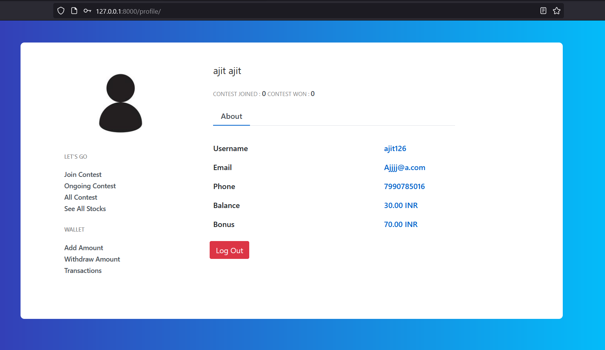

# stock-market-fantasy-game

This project is for educational purposes only.

This project is inspired from dream11 , but here contests are based on Prediction of indian stock .
User has to create a portfolio, of 5000 inr and then join a contest, at the end of the day person whose protfolio gives maximum result is declared winner.

<h3> FEATURES: </h3>
  <ol>
  <li>fully working authentication system</li>
  <li>Forget Password functionality, with token based operation </li>
  <li>Email verification</li>
  <li>Periodic task are operated using huey library, a lightweight alternative of redis/RabbitMq. </li>
  <li>Contest cannot be joined after 9:30am and before 4:00pm IST ,as duiring that time indian stock markets are active </li>
  <li>Contest can be joined but not playable during saturday and sunday, as stockmarket is closed</li>
  <li>Razorpay integration for payments</li>
    
  </ol>

<h3> Screenshots </h3>

<table>
  
  
  <tr>
    <td>Signup Page</td>
     <td>Profile Page</td>
  </tr>
  <tr>
    <td></td>
    <td></td>
  </tr>
  <tr>
    <td>Availabe Contests </td>
     <td>Contest joining</td>
  </tr>
  <tr>
    <td></td>
    <td></td>
  </tr>
  <tr>
     <td>Add Money</td>
    <td>Transaction History</td>
  </tr>
  <tr>
    <td></td>
    <td></td>
  </tr>
  
  </table
 
